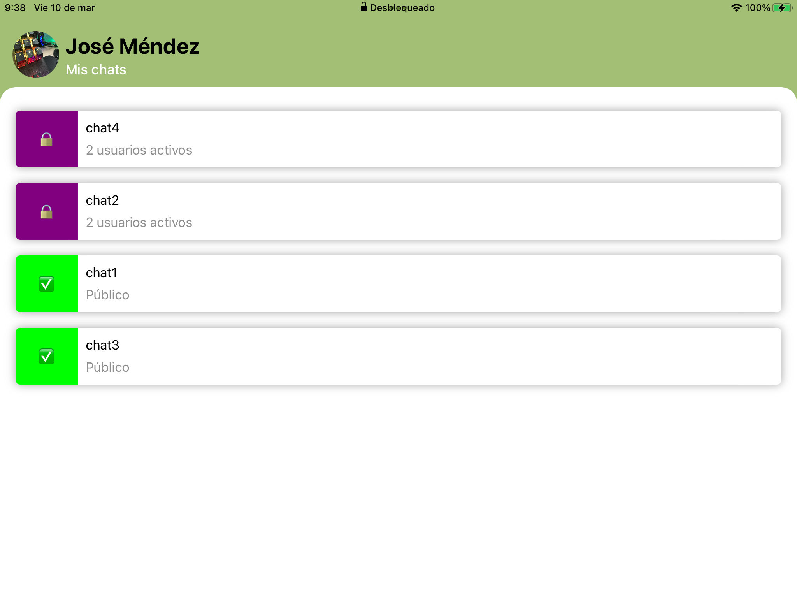

# FriendlyChat - Firestore
Test con conexion a Firestore 

Ejercicio Técnico
Requisitos:
<ul>
<li> La aplicación debe permitir a los usuarios iniciar sesión con su cuenta de correo electrónico y contraseña. &#10003;</li>
<li> Los usuarios deben poder ver una lista de conversaciones a las que están suscritos. &#10003;</li>
<li> Al seleccionar una conversación, los usuarios deben poder ver todos los mensajes de la conversación y enviar nuevos mensajes. &#10003;</li>
<li>  Los usuarios deben poder ver su perfil y actualizar su nombre de usuario y foto de perfil. &#10003;</li>
<li> Todos los datos de usuario, conversación y mensaje deben ser almacenados en Firebase Firestore. &#10003;</li>
<li> Debe haber un sistema de autenticación y autorización para garantizar que los usuarios solo puedan acceder a las conversaciones a las que tienen acceso. &#10003;</li>
<li>La aplicación debe seguir los principios de Clean Architecture, con separación de
responsabilidades en capas, tales como Domain, Data, y Presentation. (A medias)</li>
 
Puntos por considerar:
<ul>
<li>El código debe ser claro y bien organizado, y seguir los principios de Clean Architecture. (A medias) </li>
<li>Debe haber una buena cobertura de pruebas unitarias. (Faltó tiempo) </li>
<li>La aplicación debe ser fácil de usar y tener una interfaz de usuario intuitiva.&#10003;</li>
<li>El código debe estar escrito en Swift.&#10003;</li>
<li>Debe utilizarse Firebase Firestore como plataforma de backend.&#10003;</li>
<li>Para completar esta prueba técnica, el desarrollador deberá entregar una aplicación de iOS
completamente funcional que cumpla con los requisitos mencionados anteriormente. Además,
deberá proporcionar el código fuente de la aplicación y cualquier documentación necesaria
para ejecutarla y compilarla. También se recomienda proporcionar cualquier comentario
adicional sobre las decisiones de diseño y la estructura del código.&#10003;</li>
</ul>
 

Adicionales incluidos en el proyecto:
 

<ul>
<li>Se debe de soportar iOS 13 o superior.&#10003;</li>
<li>Se debe de ocupar XCode 13 o superior.&#10003;</li>
<li>Se debe de ocupar Swift 5.</li>
<li>El código fuente se debe de subir en un servidor público de GIT (GitHub/BitBucket/etc...).&#10003;</li>
<li>Se consideran 3 días(fin de semana) para esta prueba.</li>
</ul>

 
Consideraciones
<ul>
<li>El proyecto se creó a partir de:  
 - [Firebase Swift Codelab](https://codelabs.developers.google.com/codelabs/firebase-ios-swift/).
   Por tanto, la versión que se utilizó de Swift se heredó del inicio del proyecto
</li>
<li>Para correr el proyecto es necesario ir a la ruta /ios-starter/swift-starter</li>
<li>Se consideran chats publicos y privados, por tanto los usuarios que ingresen a la aplicación no podran ver los chats privados (o no deberían)

  

</li>
</ul>

 
 

Opcionales que me gustaría implementar
<ul>
<li>Mejorar la interfaz de usuario</li>
<ul>
<li>Mejorar la paleta de colores</li>
<li>Añadir animaciones</li>
</ul>
</li>
</ul>

## License
See [LICENSE](LICENSE)
